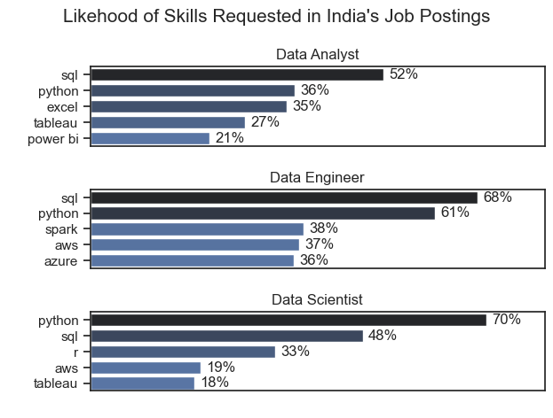
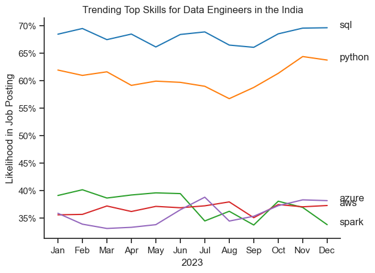
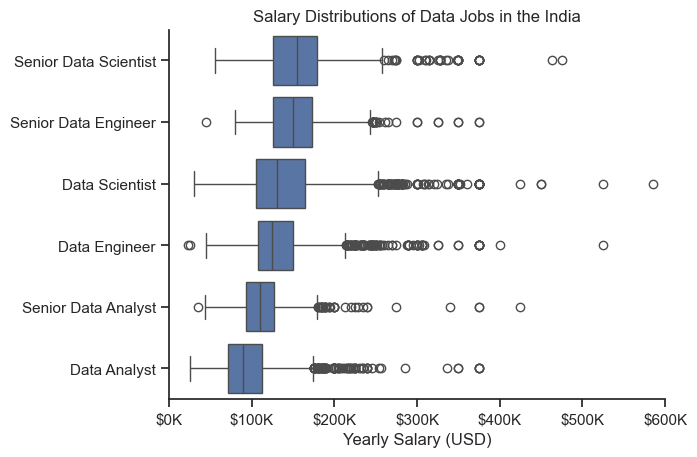
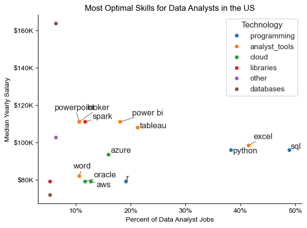

# Project Analysis

## 1.What are the most demanded skills for the top 3 most popular data roles ?

View my notebook for detailed steps:                      
[2_Skills_count.ipynb](3_project/2_Skills_count.ipynb)

### Visualize Data 

```python
fig, ax = plt.subplots(len(job_titles), 1)

for i,job_title in enumerate(job_titles):
    df_plot = df_skills_count[df_skills_count.job_title_short == job_title].head(5)
    df_plot.plot(kind='barh', x='job_skills', y='skill_count', ax=ax[i], title= job_title,legend=False)
    ax[i].invert_yaxis()
    ax[i].set_ylabel(" ")

fig.suptitle("Counts of job skills in Job Postings", fontsize = 15)
plt.tight_layout(h_pad=1)
plt.show()
```

### Results 



### Insights

- SQL is the most in-demand skill across all roles, required in 52% of Data Analyst, 68% of Data Engineer, and 48% of Data Scientist job postings.

- Data Analysts rely more on business tools like Excel (35%), Tableau (27%), and Power BI (21%), while coding (Python – 36%) is secondary.

- Data Engineers and Data Scientists prioritize programming and advanced tools, with Engineers focusing on cloud/big data (Spark, AWS, Azure) and Scientists emphasizing Python (70%) and R (33%).


# The Analysis

## 2. How are in-demand skills trending for Data Engineer?

### Visualize Data 

```python 
df_plot = df_DA_India_percent.iloc[:,:5]

sns.lineplot(data=df_plot, dashes= False, palette='tab10')
sns.set_theme(style='ticks')
sns.despine()
plt.title('Trending Top Skills for Data Engineers in the India')
plt.ylabel('Likelihood in Job Posting')
plt.xlabel('2023')
plt. legend().remove()

from matplotlib.ticker import PercentFormatter
ax=plt.gca()
ax.yaxis.set_major_formatter(PercentFormatter(decimals=0))

for i in range(5):
    plt.text(11.5,df_plot.iloc[-1,i], df_plot.columns[i])
```
### Results



### Insights 

- SQL remains the most in-demand skill, consistently appearing in ~68–70% of job postings throughout 2023.

- Python demand is strong and growing, climbing from ~57% mid-year to nearly 64% by December.

- Cloud & big data tools (Azure, AWS, Spark) show relatively stable but lower demand (~35–40%), highlighting specialization opportunities beyond core SQL/Python skills.


# Analysis

## 3. How well do job and skills pay for Data Analysts ?

### Salary Analysis 

#### Visualize Data

```python 
sns.boxplot(data=df_US_top6, x='salary_year_avg', y='job_title_short', order=job_order)
sns.set_theme(style='ticks')
sns.despine()

plt.title('Salary Distributions of Data Jobs in the India')
plt.xlabel('Yearly Salary (USD)')
plt.ylabel('')
plt.xlim(0, 600000) 
ticks_x = plt.FuncFormatter(lambda y, pos: f'${int(y/1000)}K')
plt.gca().xaxis.set_major_formatter(ticks_x)
plt.show()
```
#### Results 



#### Insights 

- Senior roles pay significantly higher: Senior Data Scientists and Senior Data Engineers have median salaries well above $150K, with wide ranges extending toward $300K+.

- Data Engineers earn slightly less than Data Scientists, but both roles show high-paying opportunities compared to Data Analysts.

- Data Analysts & Senior Data Analysts earn the lowest, with medians below $120K, highlighting that analytics roles tend to be less lucrative than engineering or science tracks.

# The Analysis

## 4.What is the most optimal skills to learn for Data Analysts?

### Visualize Data 
```python 
sns.scatterplot(
    data=df_DA_skills_tech_high_demand,
    x='skill_percent',
    y='median_salary',
    hue='technology'
)

sns.despine()
sns.set_theme(style='ticks')

# Prepare texts for adjustText
texts = []
for i, txt in enumerate(df_DA_skills_high_demand.index):
    texts.append(plt.text(df_DA_skills_high_demand['skill_percent'].iloc[i], df_DA_skills_high_demand['median_salary'].iloc[i], txt))

# Adjust text to avoid overlap
adjust_text(texts, arrowprops=dict(arrowstyle='->', color='gray'))

# Set axis labels, title, and legend
plt.xlabel('Percent of Data Analyst Jobs')
plt.ylabel('Median Yearly Salary')
plt.title('Most Optimal Skills for Data Analysts in the US')
plt.legend(title='Technology')

from matplotlib.ticker import PercentFormatter
ax = plt.gca()
ax.yaxis.set_major_formatter(plt.FuncFormatter(lambda y, pos: f'${int(y/1000)}K'))
ax.xaxis.set_major_formatter(PercentFormatter(decimals=0))

# Adjust layout and display plot 
plt.tight_layout()
plt.show()
```
### Results 



### Insights

- SQL, Excel, Python are the top 3 core skills every Data Analyst must know – they cover the majority of job demand and offer solid salaries (~$90K–95K).

- Visualization & BI tools (Tableau, Power BI, Looker, Spark) are less in demand but bring higher salaries (~$110K–115K), making them strong differentiators once you master the basics.

- Cloud tech (Azure, AWS) and niche databases are future-oriented; Azure leads to better career growth, while AWS/Oracle have lower pay. Word/PowerPoint remain baseline tools with minimal impact on salary.


